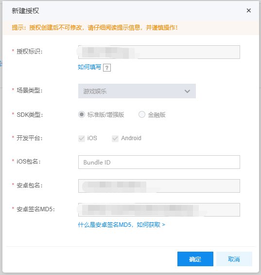
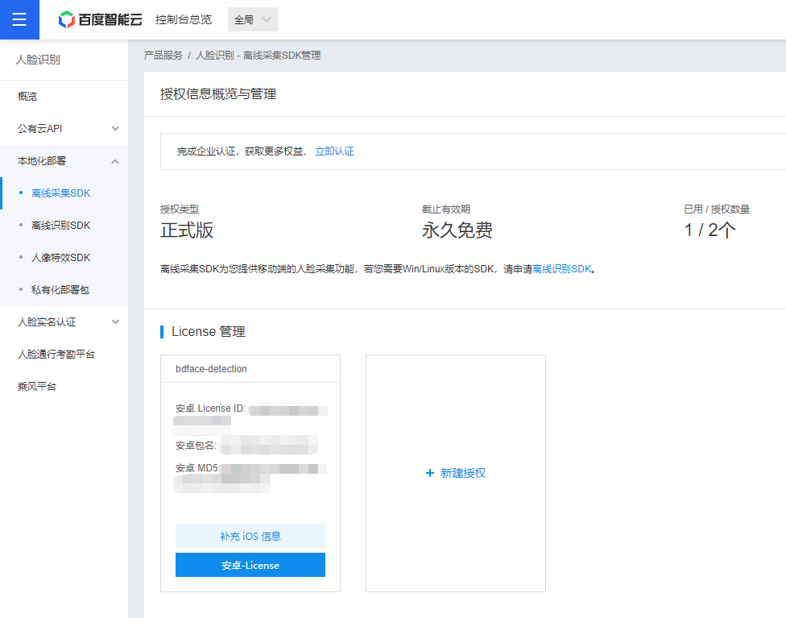
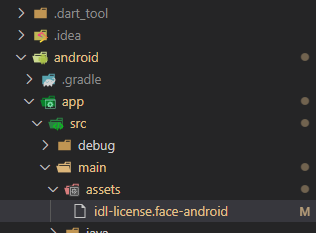
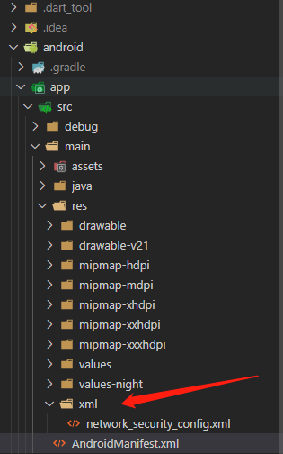

# 百度离线人脸采集

> [flutter完整打包apk签名配置教程 | 浆糊之家 (jonhuu.com)](https://www.jonhuu.com/sample-post/1627.html)
>
> [fluttercandies/flutter_bdface_collect:  百度人脸离线采集插件，只支持安卓和iOS](https://github.com/fluttercandies/flutter_bdface_collect)

基于 **flutter_bdface_collect** ，在 **flutter** 应用中实现百度离线人脸采集

### 申请百度离线采集SDK

- 选择**离线采集SDK**，填写相关信息申请（一般半小时左右就可以）

### 新增百度SDK授权

- 申请成功后新建授权，如下界面填写相关信息（**首先得有安卓签名具体获取查看下面安卓签名获取方法**）
- 填写MD5时去掉冒号即可（我只填写了安卓因为IOS可以补填）
- 注意这里慎重填写，因为百度只给两个 **License** 而且不能修改，填错需要重新申请账号

#### 

## Android

### 安卓签名（获取MD5值）及签名配置

> 这里采用 [**浆糊之家**](https://www.jonhuu.com/sample-post/1627.html) 大佬的方法详细过程可以看帖子（需要注意尝试过N多JDK之后获取签名文件MD5值必须需要**JDK 1.8.0_171** ）

- **[生成安卓签名文件](https://flutter.cn/docs/deployment/android)** 

在 Windows 系统上，执行下述代码：

```shell
  keytool -genkey -v -keystore c:\Users\USER_NAME\upload-keystore.jks -storetype JKS -keyalg RSA -keysize 2048 -validity 10000 -alias upload
```

- 获取签名文件**MD5**值，[**百度文档**](https://client-sdk.bj.bcebos.com/doc/face/%E5%AE%89%E5%8D%93%E7%AD%BE%E5%90%8DMD5%E6%96%87%E6%A1%A3.pdf?authorization=bce-auth-v1%2F529dc59c70314dbeabf86d3972c66238%2F2017-10-19T11%3A36%3A18Z%2F-1%2Fhost%2F6d75b25bc8ddfd3de745efadf25b6f2504d6cafe5aada6fcffad6bc8e651ab29)

```shell
keytool -list -v -keystore keystore.jks
```

- **xxx-keystore.jks** 文件的配置在  [**浆糊之家**](https://www.jonhuu.com/sample-post/1627.html) 帖子中有详细过程（在**key.properties**需要配置授权文件的路径）

### 配置授权到Flutter项目

- 配置好授权后你的新授权信息会出现在License管理中，点击 **安卓-License** 会下载一个**idl-license.face-android**的文件



- 在 Android 项目的**app/src/main/assets** 目录下放入百度离线采集SDK的Android授权文件，文件名固定为 **idl-license.face-android** SDK 会校验 apk 签名，请使用申请授权相符的签名证书



- 在 **AndroidManifest.xml** 的 **application** 标签内添加以下内容：

```xml
<!--将 com.baidu.idl.face.demo 替换成您安卓工程的包名-->
<provider android:authorities="com.baidu.idl.face.demo.liantian.ac.provider"
    android:name="com.baidu.liantian.LiantianProvider" android:exported="true"/>
```

### 网络安全配置

- 新建 XML 文件夹 添加 **network_security_config.xml**，详细自行  [**Google**](https://www.google.com.hk/search?q=network_security_config&oq=network_security_config&aqs=edge..69i57.1037j0j1&sourceid=chrome&ie=UTF-8)



-  **network_security_config.xml** 文件配置如下

```xml
<?xml version="1.0" encoding="utf-8"?>
<network-security-config>
    <base-config cleartextTrafficPermitted="true">
        <trust-anchors>
            <certificates src="system" overridePins="true" />
            <certificates src="user" overridePins="true" />
        </trust-anchors>
    </base-config>
</network-security-config>
```

- 然后再到 **AndroidManifest.xml**  中添加此配置

```xml
<manifest xmlns:android="http://schemas.android.com/apk/res/android"
    package="com.bdface.facedemo">
   <application
        android:label="facedemo"
        android:icon="@mipmap/ic_launcher"
        android:requestLegacyExternalStorage="true"
        android:networkSecurityConfig="@xml/network_security_config">
        <activity......
```

## IOS

> ios配置还在路上

### 体验


